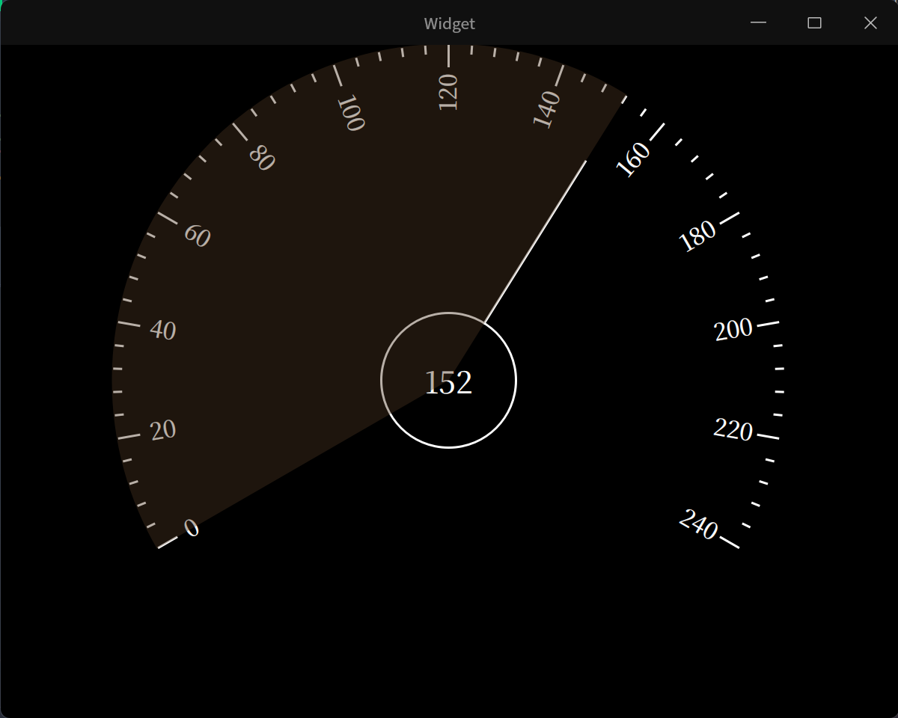

# Learning Qt

# 1. 简介

作为 Qt 开发和 C++ 学习项目。

# 2. 开发环境

> 工具链：gcc 14、ninja、GDB、CMake 3.29
>
> Qt 版本：6.8.1
>
> IDE：Qt Creator(15.0.1)、CLion(2024.3.3)
>
> C++版本：C++20

# 3. 编译

## 3.1 IDE构建

本项目通过CLion实现项目管理，可以直接通过下载或克隆本项目后通过CLion或VScode构建。

> 通过 CLion 编译该项目，建议 Fork 本项目后通过“克隆仓库”方式打开。

在 CLion 构建中，请在 `设置 -> 构建、执行、部署 -> CMake` 中在 `CMake选项` 中添加语句：

```txt
-DCMAKE_PREFIX_PATH:PATH=target_qt
# 例如：
-DCMAKE_PREFIX_PATH:PATH=$HOME/environment/Qt/6.8.1/gcc_64
```

## 3.2 CMake构建

进入本项目，执行如下命令：

```bash
git clone https://github.com/Free-Aaron-Li/learning_qt6
cd learning_qt6
mkdir build && cd build
cmake -DCMAKE_C_COMPILER=target_gcc14 -DCMAKE_CXX_COMPILER=target_g++14 -DCMAKE_INSTALL_PREFIX=$(pwd) ..
make install
```

构建完成后，将会在 `build` 目录下 生成 ` bin ` 目录，其中包含各章节实现的可执行程序。

完整的单元项目`CMakeLists.txt`配置文件可在[first_demo][1]中查看。

[1]:./first_demo/CMakeLists

# 4. 项目内容

## 4.1 [记事本（notebook）][2]

[2]:./notebook


**功能**

- 支持文本创建、打开、保存、关闭功能。
- 打开、保存、放大（缩小）快捷键。
- 底部显示行列号及文本字符编码。
- 内容编码转换。
- 支持字体放大缩小（ `Ctrl` 加鼠标滚轮方式）。

## 4.2 [雷达][3]

[3]:./radar


**功能**

- 通过渐变实现阴影旋转。

## 4.3 [简易汽车仪表盘][4]

[4]:./dash_board



**功能**

- 通过定时器实现指针旋转。
- 通过渐变实现阴影旋转。
- 通过`drawLine`以及`drawText`实现指针刻度及时速。

## 4.4 [汽车仪表盘][5]

[5]:./dash_board_plus


**功能**

- 在简易汽车仪表盘基础上美化设计。